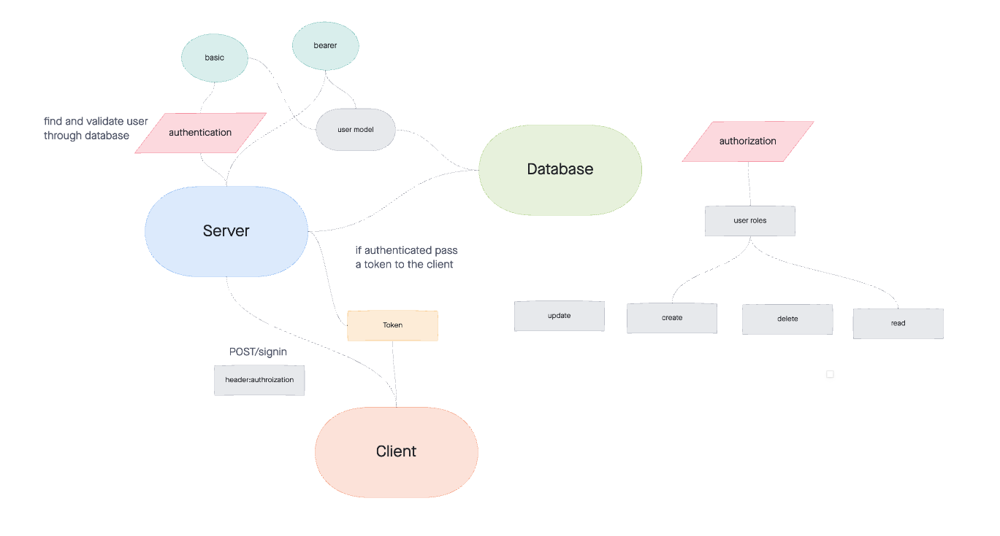

# Auth Api

Created by Sarah Creager

## Installation
`npm install`  

*sample .env file:*
``` 
PORT=3001

DATABASE_URL=
```

## Dependencies
 


## Summary of Problem Domain
Built basic auth server that allows authentication with username and password and authorization with JWT.

## Links to application deployment

[Deployed Heroku Application]()

[GitHub](https://github.com/SarahCreager/auth-api.git)

## UML



## Routes

